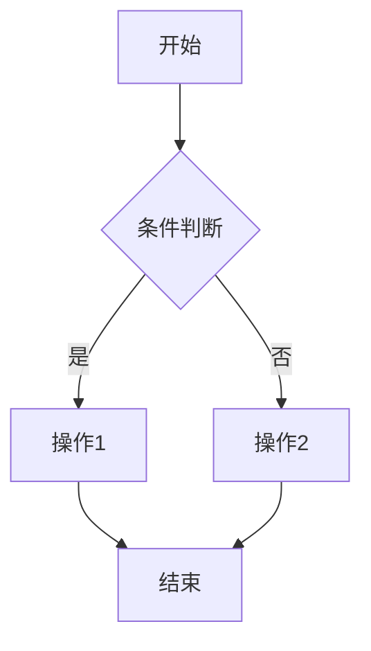
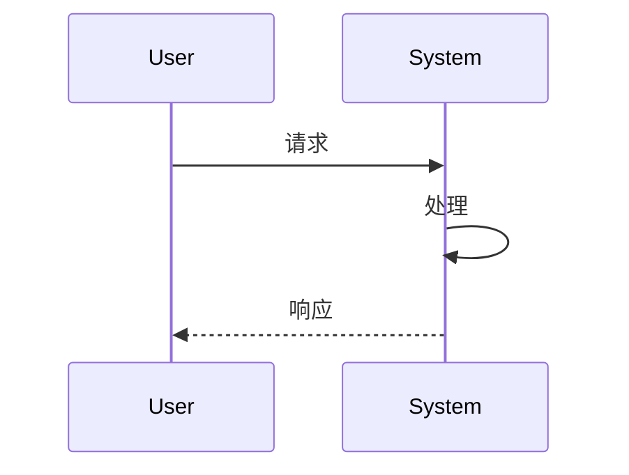
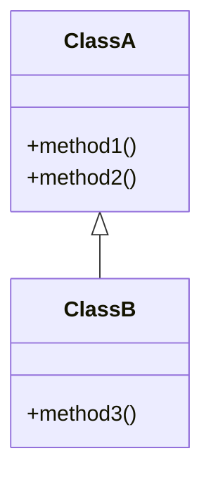

# Code Documenter - 项目学习文档生成器

## 概述

此技能分析项目代码和文档，生成结构化的学习文档，帮助新人快速理解项目架构、模块功能和实现细节。

## 核心原则

### 1. 从整体到局部
- 先介绍整个项目的主要工作流程和架构
- 再分别深入各个功能模块的详细说明
- 确保读者能够建立完整的认知框架

### 2. 图文并茂
- **必须**为所有主要流程和模块功能绘制流程图或示意图
- 使用 Mermaid 图表语法创建可视化图表
- 除非功能极其简单（如单一 getter 方法），否则必须有图解

### 3. 深度说明
每个模块的说明必须包含：
- **背景**：为什么需要这个功能？解决了什么问题？
- **实现细节**：具体是如何实现的？使用了什么技术或模式？
- **设计理由**：为什么选择这种实现方式？有哪些替代方案被否决？
- **问题解决**：这个功能解决了什么具体的技术或业务问题？

### 4. 全面覆盖
- **严禁忽略任何模块**，无论其大小或重要性
- 每个文件、每个类、每个主要函数都需要被记录
- 配置文件、工具函数、辅助模块都不能遗漏

## 使用流程

### 第一步：项目探索

运行项目分析脚本，收集完整的项目结构信息：

```bash
python scripts/analyze_project.py <project-root>
```

此脚本会：
- 扫描所有源代码文件
- 提取函数、类、模块的依赖关系
- 识别项目的主要入口点和工作流程
- 生成初步的项目结构报告

### 第二步：生成主文档

基于分析结果，生成学习文档 `PROJECT_LEARNING_GUIDE.md`：

```bash
python scripts/generate_docs.py <project-root> --output docs/PROJECT_LEARNING_GUIDE.md
```

### 第三步：人工审核与补充

**关键步骤**：自动生成的文档需要人工审核：
- 验证所有模块是否都被覆盖
- 补充设计决策和背景信息
- 添加实际使用示例
- 优化流程图的清晰度

## 文档结构模板

生成的学习文档应遵循以下结构：

```markdown
# 项目名称 - 学习指南

## 第一部分：项目概览

### 1.1 项目简介
- 项目目标和用途
- 主要技术栈
- 核心特性

### 1.2 整体架构
[架构图 - 展示主要组件及其关系]

### 1.3 主要工作流程
[主流程图 - 从请求到响应的完整流程]

## 第二部分：模块详解

### 模块一：[模块名称]
#### 背景与目标
- 为什么需要这个模块
- 解决了什么问题

#### 架构设计
[模块内部结构图]

#### 工作流程
[模块功能流程图]

#### 实现细节
- 关键类和函数说明
- 使用的设计模式
- 技术难点和解决方案

#### 设计决策
- 为什么选择这种实现方式
- 考虑过的替代方案
- 权衡分析

### 模块二：[模块名称]
...（同上结构）

## 第三部分：关键技术

### 3.1 [技术点一]
- 应用场景
- 实现方式
- 最佳实践

## 第四部分：开发指南

### 4.1 环境搭建
### 4.2 常见任务
### 4.3 调试技巧
### 4.4 扩展开发
```

## 图表生成规范

### 流程图


### 序列图


### 类图


## 参考资源

- **文档模板**：见 [references/DOCUMENT_TEMPLATE.md](references/DOCUMENT_TEMPLATE.md)
- **图表样式指南**：见 [references/DIAGRAM_STYLES.md](references/DIAGRAM_STYLES.md)
- **示例输出**：见 [assets/sample-output/](assets/sample-output/)

## 注意事项

1. **完整性检查**：生成文档后，对照源代码目录，确保没有遗漏任何文件
2. **准确性验证**：所有流程图和描述必须与实际代码一致
3. **可读性优化**：使用清晰的语言和适当的示例，避免过于技术化的表述
4. **版本同步**：当代码发生重大变更时，及时更新学习文档
