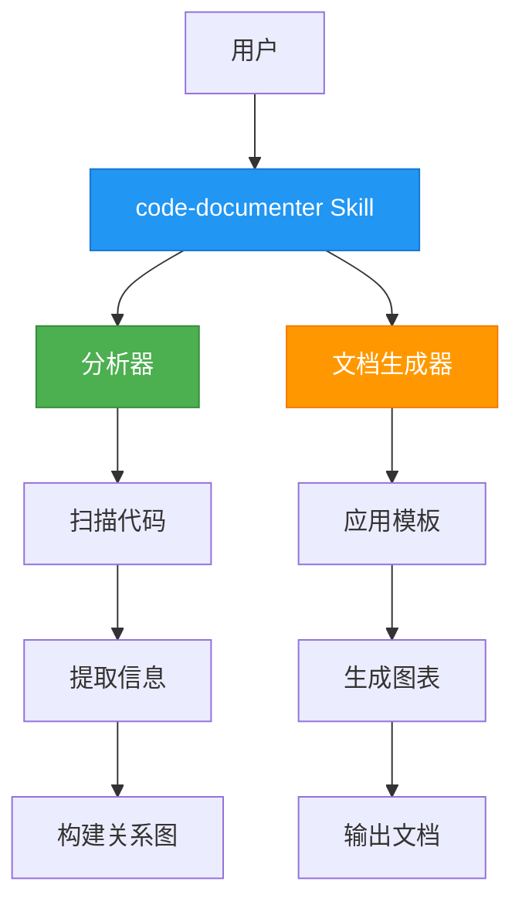
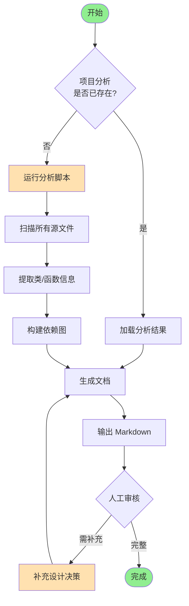
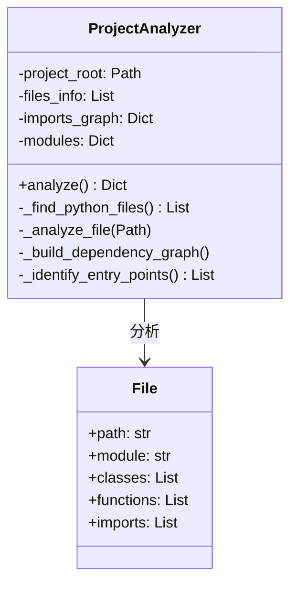
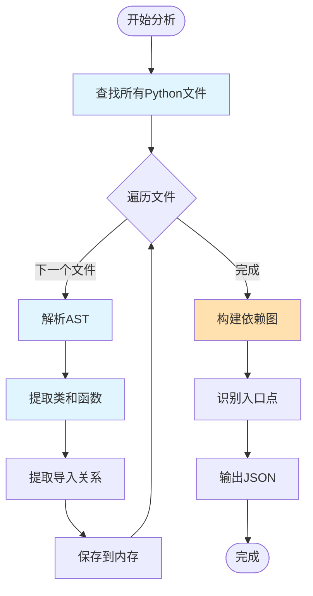
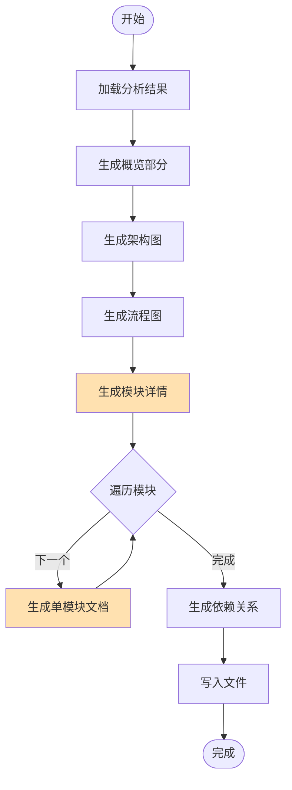
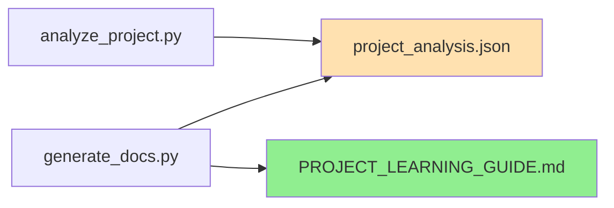

# 示例项目 - 学习指南

这是一个示例的学习文档输出，展示了使用 code-documenter skill 生成文档的预期格式和质量标准。

## 第一部分：项目概览

### 1.1 项目简介

**项目名称**: 示例项目

**项目目标**: 演示如何使用 code-documenter skill 生成高质量的学习文档

**主要技术栈**:
- Python 3.8+
- Markdown
- Mermaid 图表

**核心特性**:
- 自动分析项目结构
- 生成标准化学习文档
- 创建流程图和架构图

### 1.2 整体架构



**架构说明**:
- **用户**: 发起文档生成请求
- **Skill**: 协调整个文档生成流程
- **分析器**: 负责代码扫描和信息提取
- **生成器**: 基于分析结果生成文档

### 1.3 主要工作流程



**流程说明**:
1. **项目分析**: 扫描源代码，提取结构信息
2. **文档生成**: 应用模板，生成初步文档
3. **人工审核**: 补充设计决策和背景信息（关键步骤）
4. **迭代完善**: 根据审核结果更新文档

## 第二部分：模块详解

### 模块: analyze_project

**模块路径**: `scripts/analyze_project.py`

#### 背景与目标

**为什么需要这个模块**:
- 手动分析大型项目的代码结构非常耗时
- 需要一种系统化的方式提取代码元信息
- 为后续的文档生成提供结构化数据

**解决了什么问题**:
- 自动发现所有源代码文件
- 提取类、函数、导入关系
- 构建模块依赖图

**设计目标**:
- 快速扫描（秒级完成）
- 准确提取信息
- 支持复杂项目结构

#### 架构设计



#### 工作流程



#### 实现细节

**关键类说明**: `ProjectAnalyzer`

- **职责**: 协调整个项目分析流程
- **核心方法**:
  - `analyze()`: 主入口方法，执行完整分析
  - `_find_python_files()`: 递归扫描目录
  - `_analyze_file()`: 使用 AST 解析单个文件

**关键函数说明**:

1. **`_find_python_files()`**
   - **算法**: 深度优先搜索
   - **参数**: 无
   - **返回**: `List[Path]` 所有Python文件路径
   - **特点**: 自动排除常见的非源码目录（.git, __pycache__, venv等）

2. **`_analyze_file(file_path)`**
   - **算法**: 使用 Python AST 模块解析代码
   - **提取内容**:
     - 类定义（包括方法列表）
     - 顶层函数定义
     - 导入语句
     - 文档字符串

**使用的设计模式**:
- **Builder Pattern**: 逐步构建分析结果
- **Template Method**: 定义分析流程骨架，子步骤可定制

**技术难点**:
1. **循环导入检测**: 通过记录已分析文件避免循环
2. **相对导入解析**: 将相对路径转换为绝对模块名
3. **语法错误处理**: 对有语法错误的文件进行容错处理

#### 设计决策

**为什么选择 AST 而不是正则表达式**:
- **AST 优势**:
  - 准确理解代码结构
  - 能处理复杂语法（嵌套、装饰器等）
  - 提供上下文信息
- **正则劣势**:
  - 容易误判（字符串、注释中匹配）
  - 难以处理复杂结构
- **权衡**: AST 虽然较慢，但准确性远高于正则，对于代码分析工具更合适

**替代方案分析**:
- **使用 pylint/astroid**: 功能更强大，但依赖更重
- **使用 monkeytype**: 专注于类型推断，不适合此场景
- **最终选择**: 标准 AST 库，零依赖且满足需求

---

### 模块: generate_docs

**模块路径**: `scripts/generate_docs.py`

#### 背景与目标

**为什么需要这个模块**:
- 分析结果只是数据，需要转换为可读的文档
- 手动编写文档格式不统一
- 需要确保所有模块都被覆盖

**解决了什么问题**:
- 自动化文档生成
- 统一文档格式
- 强制执行完整性检查

**设计目标**:
- 生成结构化 Markdown 文档
- 自动插入 Mermaid 图表
- 标记需要人工补充的内容

#### 工作流程



#### 实现细节

**关键类说明**: `DocumentationGenerator`

- **职责**: 基于分析结果生成 Markdown 文档
- **核心方法**:
  - `generate()`: 主方法，生成完整文档
  - `_generate_overview()`: 生成项目概览
  - `_generate_module_details()`: 生成模块详解

**文档生成策略**:
1. 使用列表累积所有行
2. 一次性写入文件（避免频繁IO）
3. 为每个模块生成固定结构的章节

#### 设计决策

**为什么使用 Markdown**:
- 广泛支持，易读易写
- 支持代码高亮
- 可转换为其他格式（PDF, HTML）

**为什么标记"待补充"内容**:
- 自动生成无法理解设计意图
- 需要人工添加背景和决策
- 明确标记避免遗漏

---

## 第三部分：依赖关系

### 3.1 模块依赖图



**依赖说明**:
- `analyze_project.py` 生成分析数据
- `generate_docs.py` 读取分析数据生成文档
- 两者通过 JSON 文件解耦

## 第四部分：使用指南

### 4.1 快速开始

```bash
# 1. 分析项目
python scripts/analyze_project.py /path/to/project

# 2. 生成文档
python scripts/generate_docs.py /path/to/project --output docs/GUIDE.md

# 3. 审核并补充
# 打开生成的文档，补充标记为"待补充"的部分
```

### 4.2 质量检查清单

生成文档后，确保完成以下检查：

- [ ] 所有模块都有说明
- [ ] 每个模块都有"背景与目标"章节
- [ ] 主要流程都有流程图
- [ ] 设计决策已补充完整
- [ ] 包含实际使用示例
- [ ] 文档格式符合模板规范

### 4.3 最佳实践

1. **定期更新**: 代码变更后及时更新文档
2. **版本控制**: 将生成的文档纳入 Git 管理
3. **团队协作**: 让团队成员共同完善文档
4. **持续改进**: 根据反馈优化文档结构
