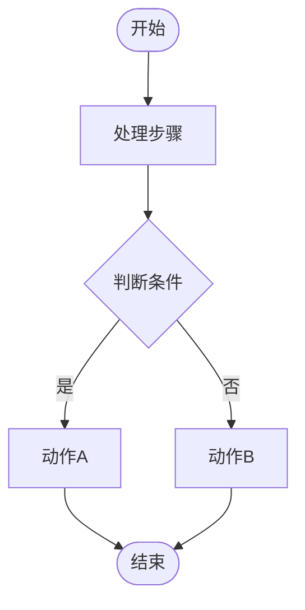
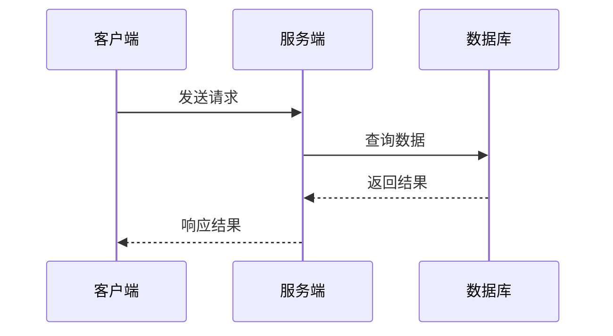
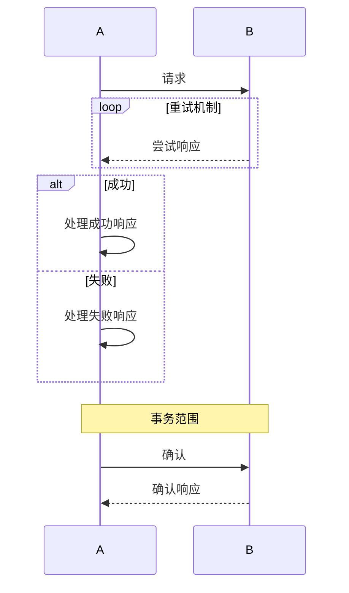
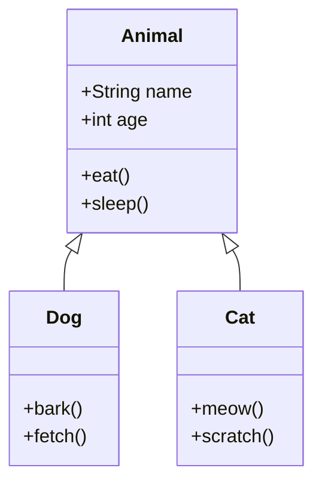
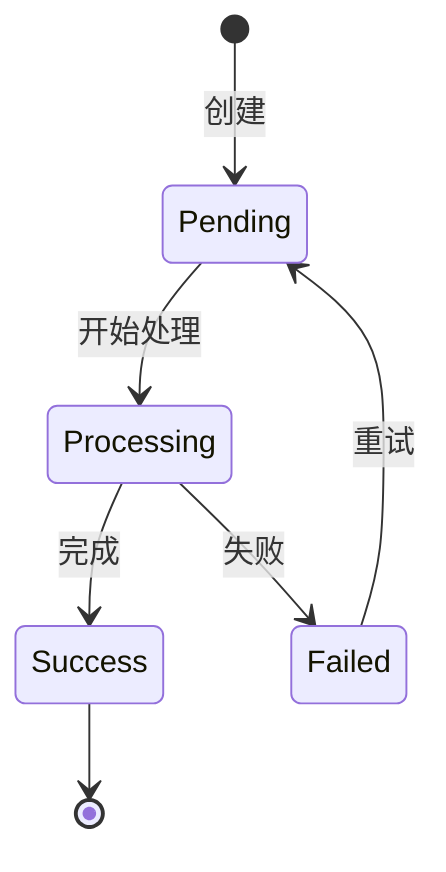
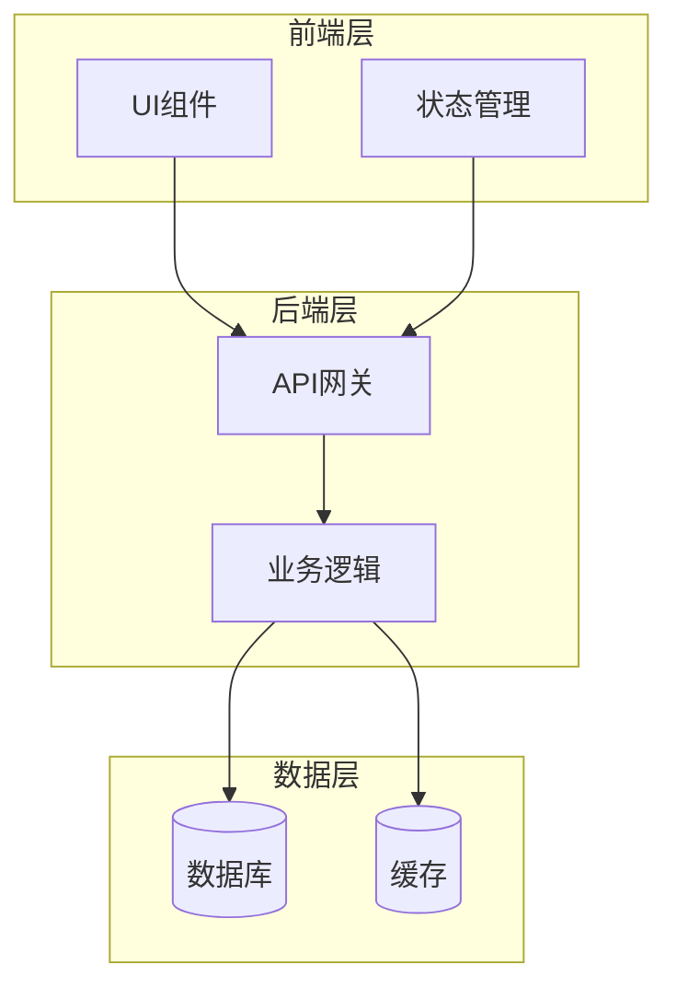
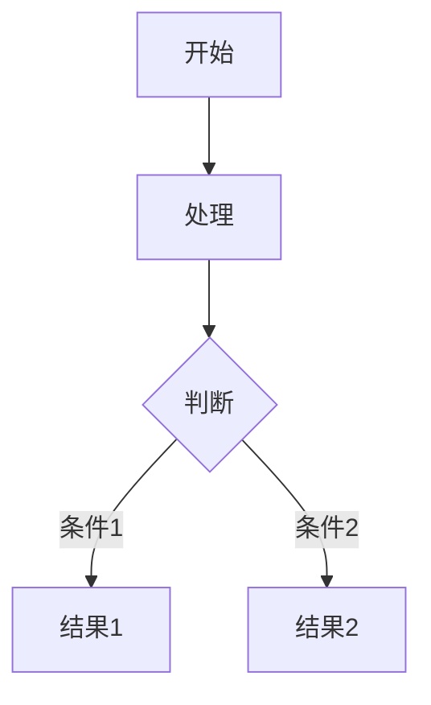

# 图表样式指南

此指南定义了学习文档中使用的图表样式和最佳实践。

## Mermaid 图表类型

### 1. 流程图 (Flowchart)

用于展示算法逻辑、业务流程、处理步骤。

#### 基本语法


#### 节点形状
- `([圆角矩形])`: 开始/结束
- `[矩形]`: 处理步骤
- `{菱形}`: 判断/决策
- `[(平行四边形)]`: 输入/输出
- `[[子程序]]`: 预定义过程
- `((圆形))`: 连接点

#### 方向
- `TD`: 从上到下 (Top to Down)
- `LR`: 从左到右 (Left to Right)
- `BT`: 从下到上 (Bottom to Top)
- `RL`: 从右到左 (Right to Left)

#### 样式规范
```mermaid
flowchart TD
    Start([开始]):::start
    Step1[正常处理]:::normal
    Error[错误处理]:::error
    Warning[警告]:::warning
    End([结束]):::end

    classDef start fill:#90EE90,stroke:#333,stroke-width:2px
    classDef normal fill:#E1F5FE,stroke:#0277BD,stroke-width:2px
    classDef error fill:#FFEBEE,stroke:#D32F2F,stroke-width:2px
    classDef warning fill:#FFF9C4,stroke:#F57C00,stroke-width:2px
    classDef end fill:#B0BEC5,stroke:#333,stroke-width:2px
```

### 2. 序列图 (Sequence Diagram)

用于展示对象之间的交互顺序，特别适合API调用、服务间通信。

#### 基本语法


#### 箭头类型
- `->>`: 同步调用（实线）
- `-->>`: 异步响应（虚线）
- `->`: 同步调用（实线，无箭头）
- `-->`: 异步消息（虚线，无箭头）
- `-x`: 错误/丢失消息

#### 高级特性


### 3. 类图 (Class Diagram)

用于展示类的结构、关系和继承层次。

#### 基本语法


#### 关系类型
- `<|--`: 继承 (Inheritance)
- `*--`: 组合 (Composition)
- `o--`: 聚合 (Aggregation)
- `-->`: 关联 (Association)
- `..|>`: 实现 (Realization/Interface)
- `..>`: 依赖 (Dependency)

#### 可见性符号
- `+`: Public
- `-`: Private
- `#`: Protected
- `~`: Package/Internal

### 4. 状态图 (State Diagram)

用于展示对象的生命周期和状态转换。

#### 基本语法


### 5. 实体关系图 (Entity Relationship)

用于展示数据库表结构和关系。

#### 基本语法
```mermaid
erDiagram
    User ||--o{ Order : places
    Order ||--|{ LineItem : contains
    Product ||--o{ LineItem : "ordered in"

    User {
        int id PK
        string name
        string email
    }
    Order {
        int id PK
        int user_id FK
        date created_at
    }
}
```

## 图表设计原则

### 1. 清晰性
- 节点名称简洁明确
- 避免过多节点（建议不超过20个）
- 使用分组或子图简化复杂图表

### 2. 一致性
- 同类型图表使用相同样式
- 颜色含义保持一致
- 布局方向统一

### 3. 可读性
- 使用中文标签（除非技术术语）
- 关键路径用不同颜色/粗细标识
- 添加图例说明

### 4. 完整性
- 标注所有重要的数据流
- 包含错误处理路径
- 标注外部依赖

## 最佳实践

### 1. 分层展示
对于复杂系统，使用多层图表：
- **高层架构图**: 展示主要组件和关系
- **详细流程图**: 展示单个模块的内部逻辑
- **交互序列图**: 展示组件间的时序交互

### 2. 使用子图


### 3. 样式定义
创建统一的样式库：

```mermaid
flowchart TD
    %% 定义样式
    classDef primary fill:#2196F3,stroke:#1976D2,color:#fff
    classDef success fill:#4CAF50,stroke:#388E3C,color:#fff
    classDef warning fill:#FF9800,stroke:#F57C00,color:#fff
    classDef danger fill:#F44336,stroke:#D32F2F,color:#fff
    classDef info fill:#00BCD4,stroke:#0097A7,color:#fff

    %% 应用样式
    Start([开始]):::info
    Process[处理]:::primary
    Success[成功]):::success
    Error[错误]):::danger
```

### 4. 注释和说明

