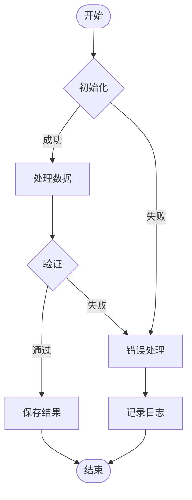
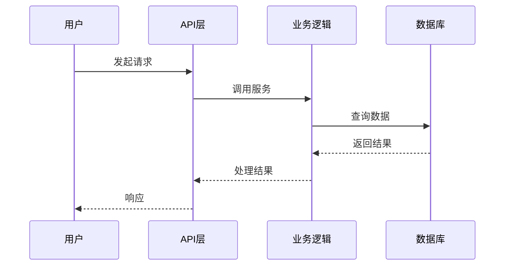
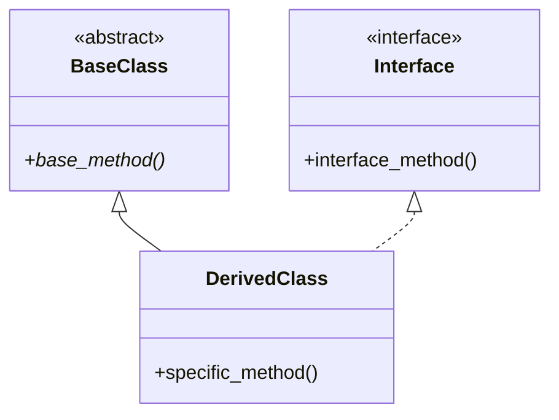

# 项目学习文档模板

此模板定义了学习文档的标准结构和格式。

## 文档结构

### 第一部分：项目概览

#### 1.1 项目简介
- 项目目标和用途
- 主要技术栈
- 核心特性列表
- 项目背景（为什么存在）

#### 1.2 整体架构
- 架构图（使用 Mermaid graph）
- 各组件职责说明
- 数据流向概述

#### 1.3 主要工作流程
- 完整的业务流程图（使用 Mermaid flowchart）
- 关键步骤说明
- 异常处理流程

### 第二部分：模块详解

每个模块必须包含以下子章节：

#### 2.X 模块名称

##### 背景与目标
- **为什么需要这个模块**：描述业务场景或技术需求
- **解决了什么问题**：明确指出要解决的核心问题
- **设计目标**：列出具体的设计目标（如性能、可维护性等）

##### 架构设计
- 模块内部结构图
- 与其他模块的交互关系
- 使用的架构模式

##### 工作流程
- 详细的处理流程图
- 关键步骤说明
- 输入输出定义

##### 实现细节
- **关键类说明**：职责、方法、属性
- **关键函数说明**：算法逻辑、参数、返回值
- **使用的设计模式**：Singleton、Factory、Observer等
- **技术难点**：遇到的挑战和解决方案

##### 设计决策
- **为什么选择这种实现**：分析各种方案的优劣
- **替代方案分析**：列出考虑过但未采用的方案及原因
- **权衡取舍**：在性能、复杂度、可维护性之间的权衡

### 第三部分：关键技术

#### 3.1 技术点一
- 应用场景
- 实现方式
- 最佳实践
- 注意事项

### 第四部分：开发指南

#### 4.1 环境搭建
- 依赖安装
- 配置说明
- 验证方法

#### 4.2 常见任务
- 任务1：步骤说明
- 任务2：步骤说明

#### 4.3 调试技巧
- 日志查看
- 断点设置
- 常见问题排查

#### 4.4 扩展开发
- 如何添加新功能
- 如何修改现有功能
- 代码规范

## 图表规范

### 流程图模板

### 序列图模板

### 类图模板

## 写作规范

### 1. 语言风格
- 使用清晰、简洁的语言
- 避免过于技术化的表述
- 为新人提供足够的上下文

### 2. 代码示例
- 每个重要功能配以代码示例
- 示例代码应有注释说明
- 包含典型使用场景和边界情况

### 3. 图表要求
- 所有非平凡功能必须有流程图
- 图表应清晰标注数据流向
- 使用统一的图表样式

### 4. 完整性检查
- [ ] 所有模块都已记录
- [ ] 所有类和主要函数都有说明
- [ ] 所有流程都有对应的流程图
- [ ] 所有设计决策都有解释
- [ ] 包含实际使用示例
